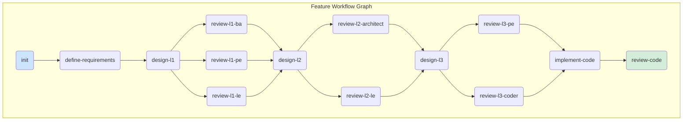

# SDD Unified Framework: Master Playbook

## 1. Introduction: A DAG-Based Workflow Engine

This document is the master guide to the Specification-Driven Development (SDD) Unified Framework. It details a robust, **parallel workflow engine** that manages a feature's lifecycle through a **Directed Acyclic Graph (DAG)** of tasks.

The framework has evolved beyond a linear state machine. It is now a collection of independent, dependency-aware commands that execute as nodes in a workflow graph. The entire graph for a feature is defined in a central `workflow.json` file, which serves as the single source of truth for the status of all tasks. This model enables maximum parallelism, allowing independent tasks (like concurrent reviews) to execute simultaneously.

---

## 2. Core Philosophy: The Workflow Graph

The framework is built on two core principles:

1.  **A Single Source of Truth (`workflow.json`):** Every feature directory contains a `workflow.json` file. This file defines all tasks, their dependencies, and their current status (`PENDING`, `READY`, `RUNNING`, `COMPLETED`, `FAILED`). It makes the feature's entire workflow explicit, persistent, and verifiable at a glance.

2.  **Dependency-Aware Commands as Task Runners:** Each command is an independent runner for a specific `task_id` in the workflow.
    *   **Dependency Check:** A command can only execute if all its dependency tasks are `COMPLETED`. It verifies this by reading `workflow.json`.
    *   **Action:** The command performs its core task (e.g., creating a design document, running a review).
    *   **Status Update:** During its lifecycle, the command updates its own task's status in `workflow.json` from `READY` to `RUNNING` and finally to `COMPLETED`, which may unblock downstream tasks.

This architecture enables a resilient, observable, and highly parallel workflow.

### How the Workflow is Defined: An Example from `workflow.json.template`

The entire workflow is defined in the master template file: [`templates/workflow.json.template`](templates/workflow.json.template). The `dependencies` array for each task is the key mechanism controlling the execution order.

Consider the following snippet from the template:

```json
  "design-l1": {
    "command": "sdd-architect-design-l1 --task_id=design-l1",
    "status": "PENDING",
    "dependencies": [
      "define-requirements"
    ]
  },
  "review-l1-ba": {
    "command": "sdd-ba-review-design-l1 --task_id=review-l1-ba",
    "status": "PENDING",
    "dependencies": [
      "design-l1"
    ]
  },
  "review-l1-pe": {
    "command": "sdd-pe-review-design-l1 --task_id=review-l1-pe",
    "status": "PENDING",
    "dependencies": [
      "design-l1"
    ]
  },
  "design-l2": {
    "command": "sdd-pe-design-l2 --task_id=design-l2",
    "status": "PENDING",
    "dependencies": [
      "review-l1-ba",
      "review-l1-pe",
      "review-l1-le"
    ]
  }
```

This demonstrates two core concepts:
1.  **Sequential Execution:** The `design-l2` task cannot begin until *all* three `review-l1-*` tasks are `COMPLETED`. The `design-l1` task is also sequential, as it depends on `define-requirements`.
2.  **Parallel Opportunity:** The three L1 review tasks (`review-l1-ba`, `review-l1-pe`, `review-l1-le`) all share the *same single dependency*: `design-l1`. As soon as `design-l1` is complete, all three review tasks become `READY` and can be executed in parallel by different agents.

---

## 3. The Feature Lifecycle as a DAG

The following diagram illustrates the complete workflow graph. Nodes represent tasks, and edges represent dependencies. A task can only start after all its parent tasks are complete. Notice how the three `review-l1-*` tasks can run in parallel.



### Task Status Definitions

*   `PENDING`: The task is waiting for one or more of its dependencies to be completed.
*   `READY`: All dependencies are `COMPLETED`. The task is now eligible for execution.
*   `RUNNING`: The task is currently being executed by an agent or process.
*   `COMPLETED`: The task finished successfully. Downstream tasks may now become `READY`.
*   `FAILED`: The task encountered an error during execution.

---

## 4. Master Command Reference & Task Dependencies

Each command executes a specific task within the graph. Its primary job is to resolve its dependencies, run, and update its status.

| Task ID | Command Executed | Dependencies |
| :--- | :--- | :--- |
| `init` | `sdd-feature-init` | - |
| `define-requirements` | `sdd-ba-define-requirements` | `init` |
| `design-l1` | `sdd-architect-design-l1` | `define-requirements` |
| `review-l1-ba` | `sdd-ba-review-design-l1` | `design-l1` |
| `review-l1-pe` | `sdd-pe-review-design-l1` | `design-l1` |
| `review-l1-le` | `sdd-le-review-design-l1` | `design-l1` |
| `design-l2` | `sdd-pe-design-l2` | `review-l1-ba`, `review-l1-pe`, `review-l1-le` |
| `review-l2-architect`| `sdd-architect-review-design-l2`| `design-l2` |
| `review-l2-le`| `sdd-le-review-design-l2` | `design-l2` |
| `design-l3` | `sdd-le-design-l3` | `review-l2-architect`, `review-l2-le`|
| `review-l3-pe`| `sdd-pe-review-design-l3` | `design-l3` |
| `review-l3-coder`| `sdd-coder-review-design-l3`| `design-l3` |
| `implement-code`| `sdd-coder-implement-code` | `review-l3-pe`, `review-l3-coder` |
| `review-code` | `sdd-le-review-code` | `implement-code` |

---

## 5. Agent Roles in the Workflow

Agent roles remain the same, but their operation is now governed by the `workflow.json` graph. An agent's command will fail if the dependencies for its assigned task are not met. The workflow progresses as agents complete tasks, unblocking other agents to work in parallel. This decentralized, dependency-driven model is the core of the new SDD Unified Framework engine.
