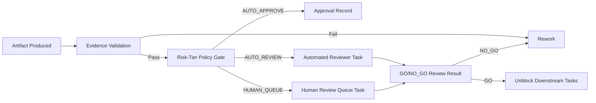

# Evidence-Based Policy Gate Overlay (V1)

This document defines how to add policy-based review routing on top of the current `sdd-unified` workflow without replacing the existing DAG, agents, or review artifacts.

## 1. Purpose

Keep current strengths:
- independent formal review gates
- evidence-based GO/NO-GO decisions
- rework loops and circuit breakers
- traceable workflow artifacts

Add this operating pattern:
- route reviews by risk tier and policy configuration
- allow automation only when required evidence is present
- send unresolved or high-risk work to human review queue

## 2. Non-Negotiable Constraints

The overlay must satisfy all of these:

1. Do not use model confidence percentage as a standalone gate criterion.
2. Formal `GO` requires objective evidence.
3. Independence of review remains intact where required.
4. T2 work requires strict gate plus human sign-off by default.
5. All routing decisions are logged and auditable.

## 3. Policy Gate Model

## Inputs

- `risk_tier`: `T0|T1|T2`
- `auto_review_enabled`: boolean
- `auto_approve_enabled`: boolean (optional, recommended only for T0)
- `required_evidence`: acceptance checks, verification checks, operational evidence, and optional requirement coverage policy

## Required Evidence Criteria

1. Requirement coverage (optional, policy-controlled):
   - map requirement IDs to stories/tasks/tests when enabled
   - treat as advisory or blocking per policy
2. Acceptance evidence:
   - acceptance criteria are explicit and testable
3. Verification results:
   - tests pass
   - lint/static checks pass
   - security/dependency checks pass (T1/T2)
4. Operational readiness:
   - release/rollback notes exist
   - observability impact recorded (T2)

## Route Decision

1. If any mandatory evidence is missing/failed: `NO_GO` -> rework.
2. Else if `risk_tier == T2`: `HUMAN_QUEUE`.
3. Else if `risk_tier == T1` and `auto_review_enabled == true`: `AUTO_REVIEW`.
4. Else if `risk_tier == T1` and `auto_review_enabled == false`: `HUMAN_QUEUE`.
5. Else if `risk_tier == T0` and `auto_approve_enabled == true`: `AUTO_APPROVE`.
6. Else if `risk_tier == T0` and `auto_review_enabled == true`: `AUTO_REVIEW`.
7. Else: `HUMAN_QUEUE`.

## 4. Decision Matrix

| Risk Tier | Evidence Status | Policy Flags | Route |
|---|---|---|---|
| T0 | pass | `auto_approve_enabled=true` | `AUTO_APPROVE` |
| T0 | pass | `auto_approve_enabled=false`, `auto_review_enabled=true` | `AUTO_REVIEW` |
| T0 | pass | both false | `HUMAN_QUEUE` |
| T1 | pass | `auto_review_enabled=true` | `AUTO_REVIEW` |
| T1 | pass | `auto_review_enabled=false` | `HUMAN_QUEUE` |
| T2 | pass | any | `HUMAN_QUEUE` |
| T0/T1/T2 | mandatory evidence fail/missing | any | `NO_GO` -> rework |
| T0/T1/T2 | requirement coverage below target (advisory mode) | any | route unchanged + warning |

## 5. Workflow Integration (Overlay, Not Rewrite)

Insert routing as a thin policy gate between artifact production and final approval:



Implementation note:
- Keep existing `review-*` task patterns and add a `route-review-*` task per phase.
- `route-review-*` writes route metadata into `context.json` and emits next review task ID.

## 6. Minimal Schema Additions

Extend `context.json` with policy and routing outcomes:

```json
{
  "policy_gate": {
    "policy_version": "v1",
    "auto_approve_enabled": false,
    "auto_review_enabled": true,
    "requirement_coverage": {
      "enabled": false,
      "mode": "advisory",
      "min_coverage_percent": 80
    }
  },
  "review_routing": {
    "artifact": "design/l2_component_design.md",
    "risk_tier": "T1",
    "route": "AUTO_REVIEW",
    "evidence_summary": {
      "requirement_coverage": "NOT_ENFORCED",
      "acceptance_evidence": "PASS",
      "verification_results": "PASS",
      "operational_readiness": "PASS"
    },
    "rationale": [
      "all required evidence passed",
      "T1 policy routes to AUTO_REVIEW"
    ],
    "timestamp": "2026-02-21T12:00:00Z"
  }
}
```

Extend review JSON artifact fields:
- `route`: `AUTO_APPROVE|AUTO_REVIEW|HUMAN_QUEUE`
- `risk_tier`: `T0|T1|T2`
- `evidence_summary`: pass/fail by criterion
- `requirement_coverage`: optional object `{ enabled, mode, measured_percent, min_coverage_percent, status }`
- `decision`: `GO|NO_GO`
- `failed_criteria`: explicit list
- `required_rework`: explicit actions when `NO_GO`

## 7. Guardrails

1. Block approval when required evidence is missing.
2. Keep T2 as strict gate plus human sign-off.
3. Enforce reviewer independence for `AUTO_REVIEW` in pair mode.
4. Escalate when:
   - rework iterations exceed configured limits
   - reviewer cannot validate evidence
   - repeated policy conflicts occur across phases
5. When requirement coverage is enabled in blocking mode, enforce threshold explicitly; when advisory, record warning without forced `NO_GO`.

## Recommended Defaults

Use conservative defaults until coverage measurement quality is proven:

1. Guide 1: Initial pilot
   - `requirement_coverage.enabled = false`
2. Guide 2: After baseline data is stable
   - `requirement_coverage.enabled = true`
   - `requirement_coverage.mode = advisory`
   - `requirement_coverage.min_coverage_percent = 70-80` (team-tuned)
3. Guide 3: Optional strict mode (only after sustained calibration)
   - `requirement_coverage.mode = blocking`
   - raise `min_coverage_percent` gradually (for example, +5% per release)

## 8. Rollout Plan

Phase 1 (pilot, 1-2 features):
- enforce evidence capture and route logging
- keep human review as final authority

Phase 2:
- allow `AUTO_REVIEW` for T0/T1 where evidence is complete
- keep sampled human audit (for example, 20%)

Phase 3:
- allow `AUTO_APPROVE` only for narrowly scoped T0 work with stable audit results
- continue periodic audit and policy tuning

## 9. Metrics

Track at minimum:

1. Routing distribution: `%AUTO_APPROVE`, `%AUTO_REVIEW`, `%HUMAN_QUEUE`
2. Escaped defects by route type and tier
3. Rework rate by route type and tier
4. Mean lead time by route type and tier
5. Human-audit disagreement rate for automated routes

## 10. Success Criteria

Adopt permanently only if pilot shows:

1. Lead time improves without increased escaped defects.
2. T1/T2 quality is stable or better under policy routing.
3. Human review load decreases for low-risk work.
4. Gate decisions remain explainable and auditable.
