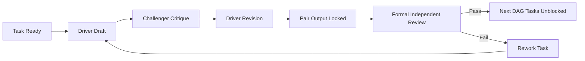

# Pair + Formal Review Overlay (V2)

This document defines how to apply a pair-programming and formal-review operating model on top of the current `sdd-unified` design without replacing the existing workflow DAG, agents, or artifacts.

## 1. Purpose

Keep current strengths:
- DAG task orchestration
- multi-agent specialization
- formal review gates
- context handoff and traceability

Add this operating pattern:
- every critical task is executed as `Driver + Challenger`
- every artifact has a single accountable owner (DRI)
- formal reviews remain independent evidence gates

## 2. First-Principles Constraints

The overlay must satisfy all of these:

1. Clear optimization target per feature:
   - lead time
   - rework rate
   - escaped defects
2. One accountable owner per artifact (no shared accountability ambiguity).
3. Decisions must be evidence-based, not confidence-only.
4. Controls must scale by risk (not all tasks need the same process weight).
5. Traceability from requirement -> story -> test -> code -> release note is mandatory.

## 3. Overlay Model

## Roles Per Task

For each workflow task, assign:
- `driver_agent`: produces the artifact
- `challenger_agent`: stress-tests assumptions in-session
- `artifact_dri`: final owner/sign-off for quality and schedule

The existing role taxonomy stays intact (`sdd-ba`, `sdd-architect`, `sdd-pe`, `sdd-le`, `sdd-coder`).

## Interaction Pattern



## 4. Mapping to Current Workflow

| Existing Task | Driver | Challenger | DRI |
|---|---|---|---|
| `define-requirements` | `sdd-ba` | `sdd-pe` | `sdd-ba` |
| `design-l1` | `sdd-architect` | `sdd-le` | `sdd-architect` |
| `design-l2` | `sdd-pe` | `sdd-architect` | `sdd-pe` |
| `design-l3` | `sdd-le` | `sdd-pe` | `sdd-le` |
| `execute-task-*` | `sdd-coder` | `sdd-le` | `sdd-coder` |
| `review-*` | independent reviewer | none | reviewer role |

Notes:
- Review tasks must remain independent from the pair that produced the artifact.
- Rework tasks keep same driver/challenger unless escalation is triggered.

## 5. Risk-Tiered Pairing Policy

Do not pair everything equally. Use risk tiers:

| Tier | Change Type | Pairing | Formal Review |
|---|---|---|---|
| T0 | docs, low-impact refactor | optional | lightweight |
| T1 | standard feature/API changes | required | standard gate |
| T2 | auth, payments, data model, infra, security-critical | required + extended challenge checklist | strict gate + human sign-off |

Default unknown work to `T1`.

## 6. Quality Gates (Evidence-Based)

A gate is `GO` only if required evidence exists:

1. Requirement coverage:
   - all requirement IDs mapped to stories/tasks
2. Acceptance evidence:
   - BDD acceptance criteria present and testable
3. Verification results:
   - tests pass
   - lint/static checks pass
   - security/dependency checks pass (for T1/T2)
4. Operational readiness:
   - release/rollback notes exist
   - observability impact recorded (for T2)

Do not use model confidence percentage as a standalone gate criterion.

## 7. Minimal Schema Additions

Extend `context.json` and review artifacts with these fields:

```json
{
  "risk_tier": "T1",
  "pair_session": {
    "driver_agent": "sdd-pe",
    "challenger_agent": "sdd-architect",
    "session_summary": "Challenger raised coupling risk; design updated."
  },
  "artifact_dri": "sdd-pe",
  "traceability": {
    "requirement_ids": ["REQ-001", "REQ-002"],
    "task_ids": ["TASK-010"],
    "test_ids": ["AC-REQ-001-1"]
  }
}
```

Review JSON should include:
- `decision`: `GO` or `NO_GO`
- `failed_criteria`: explicit list
- `required_rework`: explicit actions

## 8. Escalation Rules

Escalate if any condition is true:

1. Driver/challenger deadlock after 2 rounds.
2. T2 change with cross-team/system impact uncertainty.
3. Rework cycle exceeds configured limit.
4. Reviewer cannot validate due to missing evidence.

Escalation target: designated human reviewer or principal/architect owner.

## 9. Rollout Plan (Overlay, Not Rewrite)

Phase 1 (1-2 features):
- enable pair metadata and DRI fields
- keep current DAG as-is
- measure lead time, rework rate, escaped defects

Phase 2:
- enforce risk-tier policy
- enforce traceability fields at gates

Phase 3:
- automate gate checks from review JSON + CI outputs

## 10. Success Criteria for This Overlay

Adopt permanently only if pilot shows:

1. Escaped defects decrease or remain flat.
2. Rework loops decrease for T1/T2 tasks.
3. End-to-end lead time does not materially regress.
4. Review decisions become more consistent and auditable.
