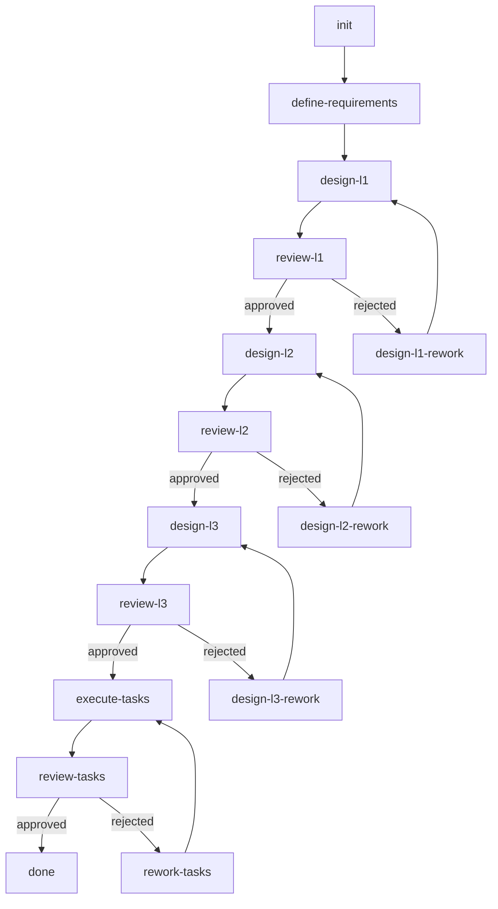

# Workflow Engine Design

**Based on:** Original WORKFLOW_ENGINE_DESIGN.md  
**Status:** Core Architecture  
**Last Updated:** 2025-10-16

## Overview

The workflow engine is the heart of sdd_unified's orchestration. It defines HOW tasks flow through the development process using a Directed Acyclic Graph (DAG) structure.

## Architecture

### Core Concept: DAG-Based Execution

The workflow is represented as a JSON file that defines:
- **Nodes:** Individual tasks (commands to execute)
- **Edges:** Dependencies between tasks
- **Agents:** Which sub-agent executes each task
- **Conditions:** Review outcomes that determine next steps

```json
{
  "workflow_id": "feature-001-auth",
  "nodes": [
    {
      "id": "define-requirements",
      "agent": "sdd-ba",
      "command": "ba/define-requirements",
      "dependencies": [],
      "outputs": ["spec/requirements.md", "spec/spec.yaml"]
    },
    {
      "id": "design-l1",
      "agent": "sdd-architect",
      "command": "architect/design-l1",
      "dependencies": ["define-requirements"],
      "outputs": ["design/l1_architecture.md"]
    },
    {
      "id": "review-l1-ba",
      "agent": "sdd-ba",
      "command": "ba/review-design-l1",
      "dependencies": ["design-l1"],
      "outputs": ["review/review_l1_ba.json"]
    }
  ]
}
```

## Workflow Phases

### Phase 1: Requirements (BA)
```
init → define-requirements
```
**Output:** Formal specification documents

### Phase 2: L1 Design (Architect)
```
define-requirements → design-l1 → [review-l1-ba, review-l1-pe, review-l1-le]
```
**Output:** High-level architecture

### Phase 3: L1 Review & Iteration
```
reviews → check-status → [approved: design-l2] OR [rejected: design-l1-rework]
```
**Output:** Validated architecture or rework

### Phase 4: L2 Design (PE)
```
approved-l1 → design-l2 → [review-l2-architect, review-l2-le]
```
**Output:** Component specifications

### Phase 5: L2 Review & Iteration
```
reviews → check-status → [approved: design-l3] OR [rejected: design-l2-rework]
```

### Phase 6: L3 Tasks (LE)
```
approved-l2 → design-l3 → review-l3-pe
```
**Output:** Discrete implementation tasks with BDD criteria

### Phase 7: Implementation (Coder)
```
approved-l3 → [execute-task-001, execute-task-002, ...] (parallel)
```
**Output:** Source code for each task

### Phase 8: Task Review (LE)
```
each task → review-task-XXX → [approved: done] OR [rejected: rework-task-XXX]
```

## Key Features

### 1. Parallel Execution

Tasks without dependencies can run in parallel:
```json
{
  "nodes": [
    {
      "id": "execute-task-001",
      "dependencies": ["design-l3-approved"]
    },
    {
      "id": "execute-task-002", 
      "dependencies": ["design-l3-approved"]  // Same dependency, can run parallel
    }
  ]
}
```

### 2. Conditional Branching

Review outcomes determine next steps:
```json
{
  "id": "check-l1-reviews",
  "type": "condition",
  "condition": "all_reviews_approved(review_l1_*)",
  "on_true": "design-l2",
  "on_false": "design-l1-rework"
}
```

### 3. Circuit Breakers

Prevent infinite loops:
```json
{
  "id": "design-l1-rework",
  "max_iterations": 3,
  "on_exceed": "escalate-to-human"
}
```

## State Management

The workflow engine tracks state in `workflow.json`:

```json
{
  "state": {
    "current_phase": "l2_design",
    "completed_tasks": ["init", "define-requirements", "design-l1", ...],
    "active_tasks": ["design-l2"],
    "blocked_tasks": [],
    "iteration_counts": {
      "design-l1": 2,
      "design-l2": 0
    }
  }
}
```

## Integration with Agentic Tools

### Assumption: Native DAG Support

sdd_unified assumes the agentic tool (Claude Code/Roo Code) can:

1. **Parse workflow.json** and understand DAG structure
2. **Execute nodes** by calling specified commands
3. **Switch agents** based on node configuration
4. **Check dependencies** before executing a node
5. **Handle conditions** based on file outputs
6. **Track state** across workflow execution

### Critical Unknowns

⚠️ **Requires Validation:**
- Does Claude Code natively support workflow.json execution?
- Can it conditionally branch based on file contents?
- How does state persist across sessions?
- Can it execute parallel tasks?

If these capabilities don't exist, we may need a thin orchestration layer.

## Template Structure

### Full Workflow Template
Located at `templates/workflow.json.template`:
- Complete SDD process
- 5 agents
- 3 design levels
- Multiple reviews
- ~20-30 nodes

### Lite Workflow Template
For simple features:
- 2 agents (Architect, Coder)
- 1 design level
- Optional reviews
- ~5-8 nodes

## Command Execution

Each node references a command file:

```
Node: design-l1
  ↓
Command: commands/architect/design-l1.yaml
  ↓
Loads: Agent prompt template
  ↓
Executes: LLM call with context
  ↓
Outputs: design/l1_architecture.md
```

## Error Handling

### Task Failures
```json
{
  "on_error": {
    "retry": 3,
    "backoff": "exponential",
    "fallback": "escalate-to-human"
  }
}
```

### Review Rejections
Automatic rework up to iteration limit, then human intervention.

### Dependency Failures
If a dependency fails, all dependent tasks are blocked.

## Monitoring

The workflow should provide:
- Real-time progress tracking
- Estimated completion time
- Current bottlenecks
- Iteration warnings

## Example: Simple Feature Flow



## Best Practices

1. **Keep tasks atomic** - Each node does ONE thing
2. **Minimize dependencies** - Allow parallel execution where possible
3. **Explicit outputs** - Every node declares what files it creates
4. **Fail fast** - Don't proceed if dependencies fail
5. **Human-in-loop** - Always provide escalation path

## Integration Points

- **Input:** Feature specification from user
- **Output:** Completed, reviewed code
- **State:** Persisted in workflow.json
- **Context:** Managed in context.json
- **Artifacts:** All outputs in feature directory

## Future Enhancements

- Dynamic task generation (add tasks based on complexity)
- Parallel review execution
- Machine learning for optimal task ordering
- Real-time collaboration support

## Summary

The workflow engine provides:
- ✅ Declarative DAG structure
- ✅ Multi-agent orchestration
- ✅ Conditional branching
- ✅ Parallel execution potential
- ✅ State tracking
- ⚠️ Assumes native tooling support (needs validation)

See also:
- [Task-Driven Implementation](task_driven_implementation.md)
- [Iterative Reviews](iterative_reviews.md)
- [Context Management](context_management.md)