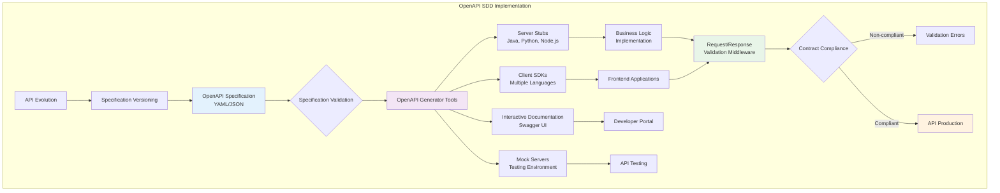
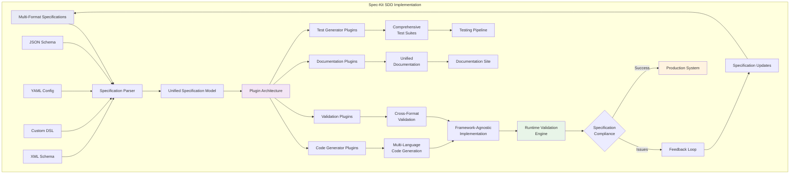
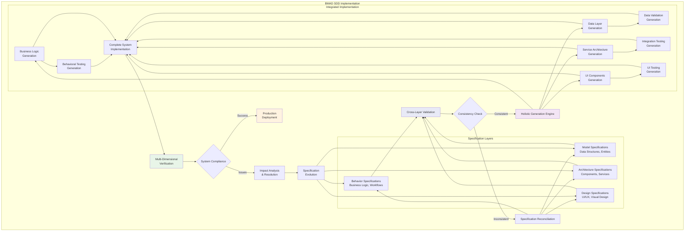
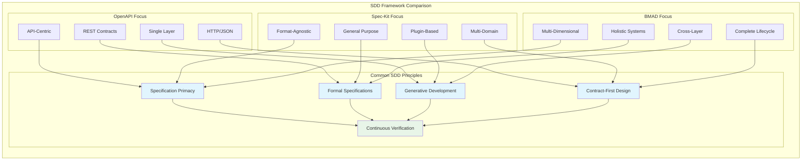
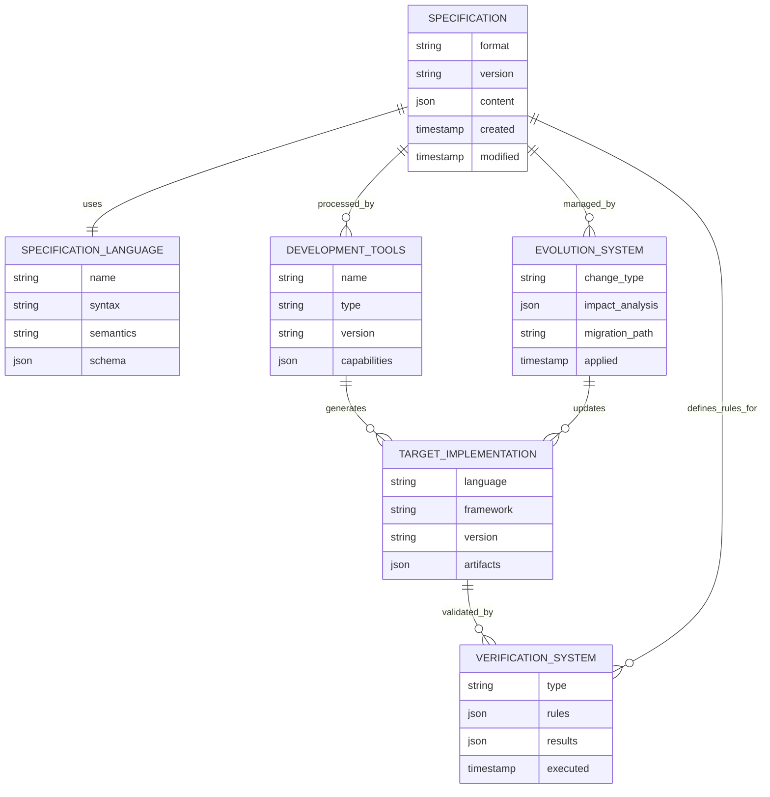

# SDD Framework Implementation Diagrams

## OpenAPI/OpenSpec Framework Architecture

## Spec-Kit General Framework Architecture

## BMAD Method Multi-Dimensional Architecture

## Comparative Framework Analysis Diagram

## SDD Core Entity Relationship Diagram

## Framework Workflow Comparison

### OpenAPI Workflow
1. **API Design** → OpenAPI Specification
2. **Code Generation** → Server stubs + Client SDKs
3. **Implementation** → Business logic in stubs
4. **Validation** → Request/response compliance
5. **Documentation** → Swagger UI generation

### Spec-Kit Workflow
1. **Multi-Format Specs** → Unified parsing
2. **Plugin Processing** → Extensible transformations
3. **Artifact Generation** → Framework-agnostic outputs
4. **Integration** → Runtime validation
5. **Evolution** → Cross-format consistency

### BMAD Workflow
1. **Multi-Layer Specs** → Behavior + Model + Architecture + Design
2. **Cross-Layer Validation** → Consistency checking
3. **Holistic Generation** → Complete system artifacts
4. **Multi-Dimensional Testing** → Comprehensive validation
5. **Integrated Evolution** → System-wide impact analysis

Each framework represents a different approach to implementing SDD principles, from OpenAPI's API-focused approach to Spec-Kit's general-purpose flexibility to BMAD's comprehensive system modeling.