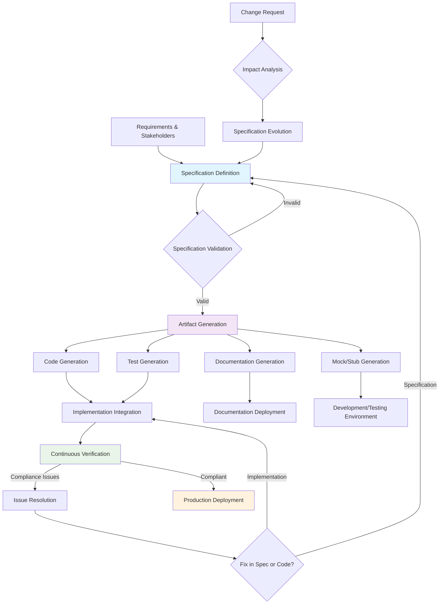

# SDD General Workflow Diagram

## Workflow Description

### Phase 1: Specification Creation
- **Requirements Gathering**: Stakeholders collaborate to define system requirements
- **Specification Definition**: Formal specifications are created using appropriate languages (OpenAPI, JSON Schema, etc.)
- **Validation**: Specifications are validated for syntax, semantics, and completeness

### Phase 2: Artifact Generation
- **Code Generation**: Development tools generate implementation scaffolds, client libraries, and server stubs
- **Test Generation**: Automated test suites are created from specification contracts
- **Documentation Generation**: Human-readable documentation is produced
- **Mock Generation**: Fake implementations for testing and development

### Phase 3: Implementation & Integration
- **Implementation Integration**: Generated artifacts are combined with manual implementation code
- **Continuous Verification**: Runtime validation ensures implementation matches specification
- **Issue Resolution**: Non-compliance issues are resolved through specification or implementation updates

### Phase 4: Evolution & Maintenance
- **Change Requests**: New requirements trigger specification updates
- **Impact Analysis**: Changes are analyzed for system-wide effects
- **Specification Evolution**: Controlled updates maintain backward compatibility