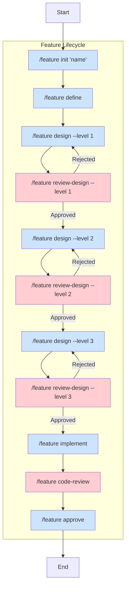

# The Specification-Driven Development (SDD) Playbook

This playbook provides a comprehensive guide to the Specification-Driven Development (SDD) framework. It covers the core principles, architecture, workflow, and practical usage instructions to help you get started.

## 1. Introduction & Guiding Principles

The SDD framework is designed to bring structure, clarity, and collaboration to AI-driven software development. It guides a feature from a high-level concept to production-ready code in a transparent and auditable manner. The framework is built upon the following six core principles.

### 1.1. Progressive Formalization through Tiered Design
The framework must guide the user from a high-level, ambiguous requirement to a machine-readable, formal specification in a structured manner.

- **Rationale**: This principle directly addresses the need for an "incrementally formalizing" system. By adopting a tiered design process (L1: Architecture, L2: Component, L3: Implementation), the framework can manage complexity at each stage, asking targeted questions to add detail progressively. This avoids overwhelming the user and ensures a solid architectural foundation before implementation begins.

### 1.2. The Spec is a Runnable, Testable Model
A specification must be more than static documentation; it must be an executable artifact that can be validated against requirements at any stage.

- **Rationale**: To build an intelligent and reliable framework, the spec itself must be a source of truth that can be tested. This means treating specs as models that can be simulated or run to verify behavior, data flows, and state transitions long before code is generated. This "runnable spec" concept provides a tight feedback loop, core to the "measure" and "adapt" philosophy.

### 1.3. Feature-Scoped, Composable Context
The framework must operate on well-defined, isolated contexts. All artifacts for a given feature—specs, designs, reviews, and code—should be self-contained.

- **Rationale**: This is the key to adaptability. For greenfield projects, features can be developed in parallel with minimal friction. For brownfield projects, the framework can be applied to a single new feature without needing to understand the entire legacy system at once. This composability simplifies context management, improves performance, and makes the framework intuitive to apply on projects of any scale.

### 1.4. Agents as Role-Based Collaborators
Agents within the system should be abstracted as team members with specific roles (e.g., Architect, Principal Engineer) rather than as purely functional tools (e.g., Generator, Reviewer).

- **Rationale**: A developer-centric framework should be intuitive. By modeling agents on familiar human roles, the system becomes easier to understand and interact with. This abstraction aligns with a human-in-the-loop process, where it's clear who (which agent) is responsible for what part of the lifecycle and where human intervention is expected.

### 1.5. Central Orchestration with Decentralized Execution
A central orchestrator should manage the overall SDD lifecycle and enforce process integrity, but the execution of tasks (design, implementation) should occur within decentralized, feature-scoped contexts.

- **Rationale**: This hybrid model offers the best of both worlds. Central orchestration ensures that every feature adheres to the same high standards of design and review. Decentralized execution prevents bottlenecks and allows for parallel, independent workstreams. The orchestrator defines the "what" (the process), while the feature-scoped agents handle the "how" (the implementation).

### 1.6. Human-in-the-Loop as a First-Class Citizen
The framework must be designed with explicit, mandatory points for human review and approval. The "human-in-the-loop" is not an escape hatch but a fundamental component of the workflow.

- **Rationale**: Automation is powerful, but true intelligence requires collaboration. By embedding review gates and feedback loops directly into the process, the framework ensures quality, architectural soundness, and trust. This makes the system a partner in development, not just a black-box code generator.

## 2. Core Architecture

The SDD framework is built around a multi-stage feature lifecycle called **Progressive Formalization**. This workflow guides a feature from a high-level concept to approved, production-ready code in a structured, transparent, and collaborative manner. Each stage invokes a specific role-based agent and produces formal artifacts, ensuring that complexity is managed and quality is maintained.

The core V2 workflow is as follows: `init` → `define` → `design-l1` → `review-l1` → `design-l2` → `review-l2` → `design-l3` → `review-l3` → `implement` → `code-review` → `approve`.

## 3. The SDD V2 Workflow

The workflow is driven by a series of slash commands that correspond to each stage of the feature lifecycle.



### 3.1. Workflow Stages

- **`init`**: Initializes the feature directory, creating the necessary structure and the `.sdd-manifest.yaml` file.
- **`define`**: The **Business Analyst (BA)** agent transforms the high-level feature concept into a formal `requirements.md` specification.
- **`design (L1, L2, L3)`**: A three-stage design process that progressively refines the solution.
- **`review-design (L1, L2, L3)`**: A formal review gate at each design level to ensure quality and alignment.
- **`implement`**: The **Lead Engineer (LE)** creates an `implementation/l3_plan.md`, which is then executed by the **Coder (CODE)** agent to write the feature's source code.
- **`code-review`**: A **Lead Engineer (LE)** or human developer reviews the generated code to validate its correctness, quality, and adherence to the plan.
- **`approve`**: A final human approval step to confirm the implementation meets all requirements before merging.

### 3.2. The Multi-Level Design Process (L1/L2/L3)

The core of the SDD V2 framework is a multi-level design process that progressively refines a feature from a high-level concept to a detailed, implementable plan. This iterative approach ensures that architectural decisions are made and validated before significant implementation effort is invested.

Each level has a specific focus, author, and set of reviewers, creating a clear separation of concerns and a robust review cycle.

#### L1: High-Level Architecture (The "What")

*   **Purpose**: To define the high-level system architecture, major components, and their interactions in response to the feature requirements. This stage focuses on the conceptual integrity of the solution.

    > *This is like an artist's rendering of a new building; it shows what it will look like from the outside and its place in the city. It sells the vision.*

*   **Author**: `Architect (ARCH)`
*   **Reviewers**: `Principal Engineer (PE)`, `Lead Engineer (LE)`
*   **Artifact**: `design/l1_architecture.md`

#### L2: Service-Level Interactions (The "How")

*   **Purpose**: To detail the interactions between services and components. This includes API contracts, data flow diagrams, and sequence diagrams that describe *how* the components will work together to deliver the feature.

    > *This is like an architect's blueprint. It shows floor plans, where the rooms are, how they connect, and where the main electrical and plumbing systems will run.*

*   **Author**: `Architect (ARCH)`
*   **Reviewers**: `Principal Engineer (PE)`, `Lead Engineer (LE)`
*   **Artifact**: `design/l2_component_design.md`

#### L3: Detailed Design (The "With What")

*   **Purpose**: To create a concrete, low-level implementation plan. This includes defining data structures, class designs, database schemas, and identifying the specific technologies and libraries to be used.

    > *This is like the detailed schematic for the electrician and plumbers, showing exactly which wires and pipes go where.*

*   **Author**: `Lead Engineer (LE)`
*   **Reviewers**: `Principal Engineer (PE)`
*   **Artifact**: `implementation/l3_plan.md`


## 4. Command Reference

The SDD framework uses an intuitive, slash-command interface to drive the feature lifecycle.

-   `/feature init "Feature Name"`: Initializes a new feature.
    -   **Action**: Creates the feature-scoped directory, the `.sdd-manifest.yaml`, and standard subdirectories.
    -   **Next Step**: `define`

-   `/feature define`: Engages the Business Analyst agent to create the feature specification.
    -   **Action**: The **BA** agent produces the formal `spec/requirements.md`.
    -   **Next Step**: `design --level 1`

-   `/feature design --level {1|2|3}`: Engages the appropriate agent to create the design for the specified level.
    -   **Action**:
        -   L1 & L2: The **Architect** agent produces the `l1_architecture.md` or `l2_component_design.md`.
        -   L3: The **Lead Engineer** agent produces the `l3_plan.md`.
    -   **Next Step**: `review-design --level {n}`

-   `/feature review-design --level {1|2|3} --action {approve|reject}`: Approves or requests changes to a design artifact.
    -   **Action**: Used by reviewers to validate the design at each stage. Approval unlocks the next stage; rejection requires the author to revise the design.
    -   **Next Step**: `design --level {n+1}` or `implement` (after L3 approval).

-   `/feature implement`: Engages the Lead Engineer and Coder agents to implement the feature.
    -   **Action**: The **LE** creates `implementation/plan.md`. The **CODE** agent then writes source code into the `src/` directory.
    -   **Next Step**: `code-review`

-   `/feature code-review {approve|reject}`: Formally approves or requests changes to the implementation.
    -   **Action**: Used by a **Lead Engineer** or developer to validate the generated source code. Approval moves the feature to the final `approve` stage; rejection requires the coder to fix the implementation.
    -   **Next Step**: `approve` (on approval)

-   `/feature approve`: Finalizes the feature.
    -   **Action**: A human developer performs a final review and merges the code into the main codebase. Marks the feature as complete.
    -   **Next Step**: End

## 5. Agent Roles

-   **Business Analyst (BA)**
    -   **Mode**: `define`
    -   **Responsibility**: Translates high-level feature requests into a formal, structured `spec/requirements.md`.

-   **Architect (ARCH)**
    -   **Modes**: `design --level 1`, `design --level 2`
    -   **Responsibility**: Designs the L1 high-level architecture and L2 service-level interactions.

-   **Lead Engineer (LE)**
    -   **Modes**: `design --level 3`, `implement` (planning), `code-review`
    -   **Responsibility**: Creates the L3 detailed design (`l3_plan.md`), creates the implementation plan, and reviews the final generated code.

-   **Principal Engineer (PE)**
    -   **Mode**: `review-design`
    -   **Responsibility**: Acts as a guardian of quality. Reviews architectural and design artifacts (L1, L2, L3) to ensure they align with best practices and long-term strategy.

-   **Coder (CODE)**
    -   **Mode**: `implement` (execution)
    -   **Responsibility**: Writes the source code based on the `implementation/l3_plan.md`.

## 6. Directory Structure

For a feature named `user-auth`, the directory structure would be:
```
/features/feature-001-user-auth/
├── .sdd-manifest.yaml
├── spec/
│   └── requirements.md
├── design/
│   ├── l1_architecture.md
│   └── l2_component_design.md
├── implementation/
│   └── l3_plan.md
└── src/
    └── ...
```

## 7. Visual Language Convention for Reviews

To streamline the review process for design artifacts, the framework uses a simple color-coding system in diagrams and documentation:

*   **<font color="green">Green</font>**: Represents new components, relationships, or logic being introduced.
*   **<font color="yellow">Yellow</font>**: Represents existing elements that are being modified.
*   **<font color="gray">Grey</font>**: Represents existing elements that are relevant for context but are unchanged.

This convention allows reviewers to quickly focus on the changes being proposed.


## 8. Installation & Setup

The framework provides two installation scripts to set up your local environment.

- **`install-claude-code.sh`**: Tailored for developers using Anthropic's Claude models.
- **`install-generic.sh`**: Provides a generic installation for use with other LLMs.

### How to Run the Scripts

To run an installation script, make it executable and run it from your terminal:

**For Claude Users:**
```bash
chmod +x install-claude-code.sh
./install-claude-code.sh
```

**For Other Model Users:**
```bash
chmod +x install-generic.sh
./install-generic.sh