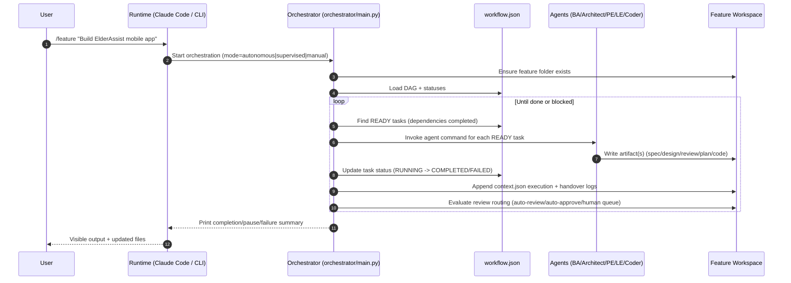
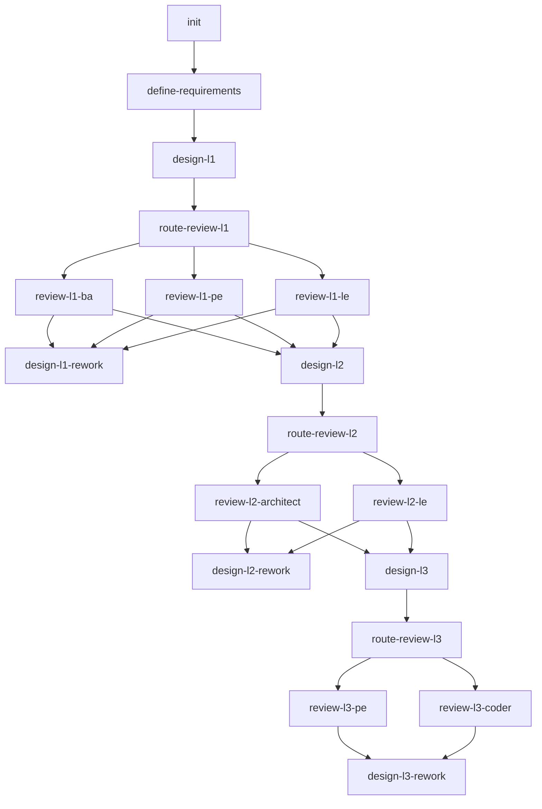

# ElderAssist Execution Visualization

This document shows what happens after you request:

`/feature "Build a mobile app for elderly assistance (ElderAssist)"`

## 1) End-to-End Request Flow

## 2) Core DAG Shape (Design + Review Loops)

## 3) What You See As Output

During execution, the orchestrator prints task-by-task logs like:

- `Task: define-requirements`
- `Agent: sdd-ba`
- `Command: sdd-ba-define-requirements --task_id=define-requirements`
- `Task ... completed successfully` (or failed/paused)

Then one of these terminal outcomes appears:

- `Workflow completed successfully`
- `Autonomous execution paused: Human review required ...`
- `No ready tasks ... Workflow may be stuck`

## 4) ElderAssist Artifacts You Can Inspect

After (or during) the run, check the feature folder for:

- `workflow.json`: source of truth for task states
- `context.json`: handovers, execution log, circuit breaker, routing info
- `spec/requirements.md`, `spec/spec.yaml`
- `design/l1_architecture.md`, `design/l2_component_design.md`
- `implementation/l3_plan.md`
- `review/*.json` (approvals/rejections/routing/human queue items)

## 5) Practical Mental Model

1. Your prompt creates feature intent.
2. `workflow.json` decides what can run next.
3. Agent commands produce artifacts and reviews.
4. Reviews can route to approve, auto-approve, human queue, or rework.
5. You see progress in logs and final state in `workflow.json` + artifacts.
