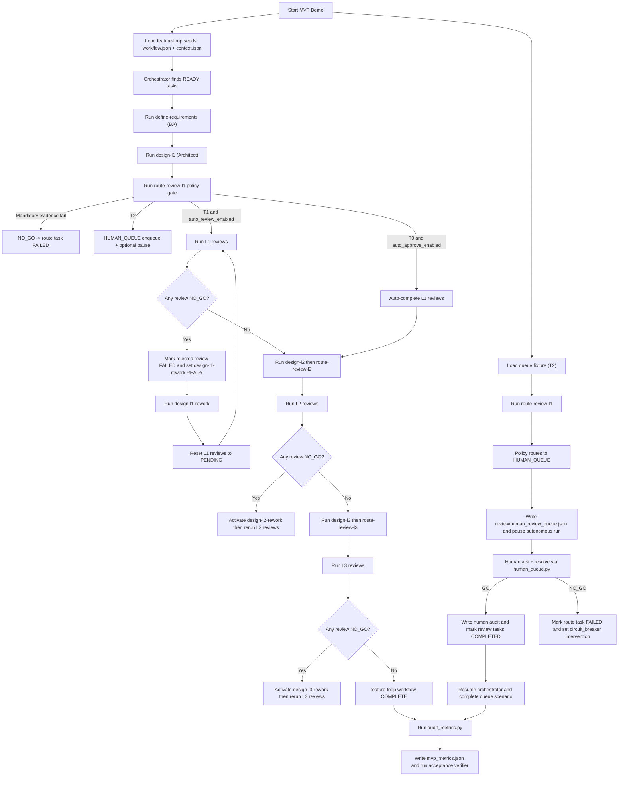

# MVP Flow Explained

This document explains the demo execution flow, including conditional branches and loop behavior.

## System Flow Diagram

## Sequence Walkthrough

1. Demo runner resets seed state for deterministic execution.
2. Orchestrator executes tasks in dependency order.
3. At each `route-review-*` task, policy gate decides route:
   - `AUTO_APPROVE`
   - `AUTO_REVIEW`
   - `HUMAN_QUEUE`
   - `NO_GO` (on mandatory evidence failure)
4. For `AUTO_REVIEW`, formal review tasks run and can reject.
5. On rejection, mapped rework task is activated and forced `READY`.
6. After rework, review tasks are reset and rerun.
7. Loop exits when all required reviews reach `GO` for that phase.
8. In T2 queue scenario, route task enqueues to file queue and pauses.
9. Human reviewer acknowledges and resolves queue item:
   - `GO`: unblocks review path and workflow completion.
   - `NO_GO`: marks route failure and raises intervention flag.
10. Metrics and acceptance checks validate observable outcomes.

## Conditional Logic Summary

- Mandatory evidence missing/fail -> `NO_GO` immediately.
- `risk_tier == T2` -> `HUMAN_QUEUE` by policy.
- `T1` with automation enabled -> `AUTO_REVIEW`.
- `T0` may `AUTO_APPROVE` when explicitly enabled.
- Rework tasks are dormant by default and only activate on rejection.

## Implementation Split (Python vs Prompt-Driven)

| Step | Action | Executed By | Mechanism | Key Files |
|---|---|---|---|---|
| 1 | Seed/reset demo state | Python/shell automation | `run-mvp-demo.sh` copies `*.seed.json`, clears generated artifacts | `validation-tests/mvp-demo/run-mvp-demo.sh` |
| 2 | Resolve next runnable task | Python orchestration | DAG dependency evaluation in orchestrator | `orchestrator/main.py` |
| 3 | Task execution call | Python orchestration | `RuntimeAdapter` invocation per task | `orchestrator/main.py`, `orchestrator/runtime_adapter.py` |
| 4 | Simulated BA/Architect/PE/LE/Coder artifact generation for demo | Prompt-equivalent command (scripted) | Task command runs `sim_agent_task.py` for deterministic artifacts | `orchestrator/sim_agent_task.py`, `validation-tests/mvp-demo/feature-loop/workflow.seed.json` |
| 5 | Policy route decision (`AUTO_REVIEW`/`HUMAN_QUEUE`/...) | Python orchestration | `route-review-*` handled directly in orchestrator via policy evaluator | `orchestrator/main.py`, `orchestrator/policy_gate.py` |
| 6 | Formal review outputs (demo) | Prompt-equivalent command (scripted) | Review task commands run `sim_agent_task.py` and write review JSON | `orchestrator/sim_agent_task.py` |
| 7 | Detect review rejection (`NO_GO`) | Python orchestration | Orchestrator reads review JSON and normalizes decision/status | `orchestrator/main.py` |
| 8 | Activate rework loop | Python orchestration | Rejected review marks mapped rework task `READY` and `activated=true` | `orchestrator/main.py` |
| 9 | Execute rework + rerun reviews | Mixed: prompt-equivalent + Python | Rework command runs scripted agent task; orchestrator resets related review tasks to `PENDING` | `orchestrator/main.py`, `orchestrator/sim_agent_task.py` |
| 10 | Human queue enqueue/pause | Python orchestration | For `HUMAN_QUEUE`, append queue item to file and optionally pause run | `orchestrator/main.py` |
| 11 | Human queue ack/resolve | Python CLI (operator action) | `human_queue.py list/ack/resolve` transitions queue + workflow state | `orchestrator/human_queue.py` |
| 12 | Metrics generation | Python automation | Scan artifacts and compute route/rework/handover stats | `orchestrator/audit_metrics.py` |
| 13 | Acceptance validation | Python automation | Verifier checks required artifacts and conditions | `validation-tests/mvp-demo/verify_mvp_acceptance.py` |

### Review Loop Specifics

The loop is implemented mostly in Python orchestration, not in prompts:

1. A review command writes `decision: NO_GO` (demo via `sim_agent_task.py`).
2. Orchestrator reads the review file and detects rejection.
3. Orchestrator sets mapped rework task to `READY` and `activated=true`.
4. Rework task executes.
5. Orchestrator resets phase review tasks to `PENDING`.
6. Reviews rerun; loop exits when reviews return `GO`.

## Where to Inspect

- Loop scenario logs: `validation-tests/mvp-demo/results/mvp_loop.log`
- Queue scenario logs: `validation-tests/mvp-demo/results/mvp_queue.log`
- Route artifacts: `validation-tests/mvp-demo/feature-loop/review/review_routing_*.json`
- Queue file: `validation-tests/policy-gate-fixtures/t2_human_queue/review/human_review_queue.json`
- Metrics: `validation-tests/mvp-demo/results/mvp_metrics.json`
